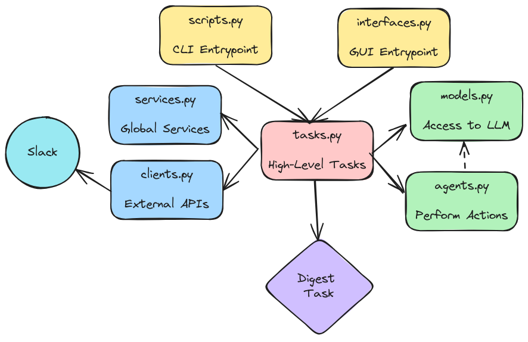
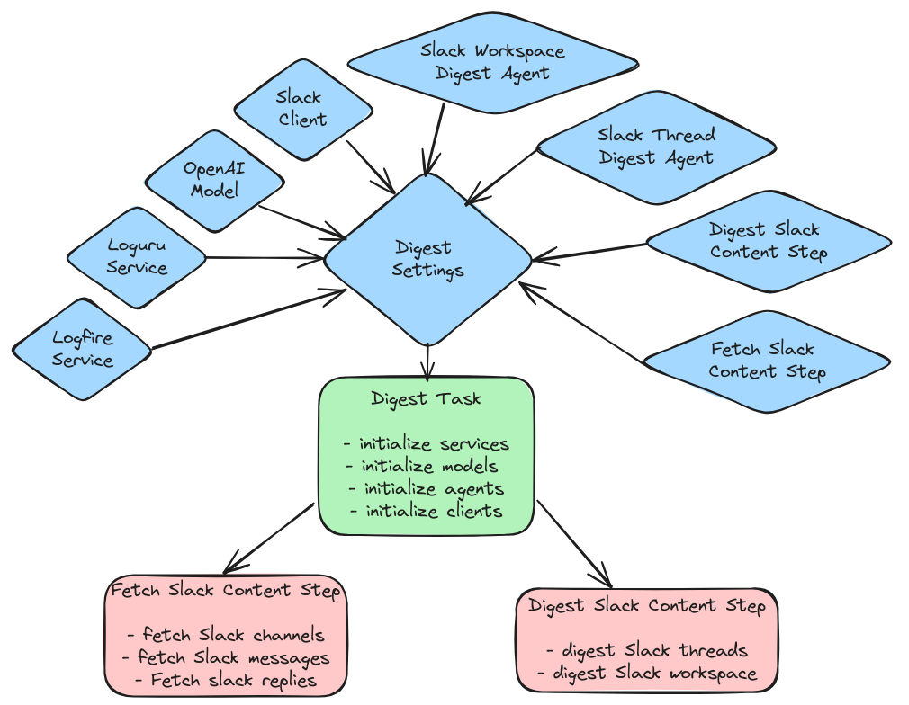
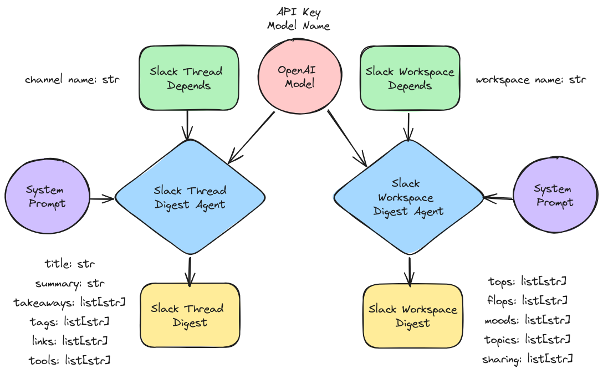

# MLOps Digester

[](https://github.com/fmind/mlops-digester/actions/workflows/check.yml)
[](https://github.com/fmind/mlops-digester/actions/workflows/publish.yml)
[](https://fmind.github.io/mlops-digester/)
[](https://github.com/fmind/mlops-digester/blob/main/LICENCE.txt)
[](https://github.com/fmind/mlops-digester/releases)

Let your agent digest MLOps information.

# Installation

Use the package manager [uv](https://docs.astral.sh/uv/):

```bash
uv sync
```

# Preparation

You need to authenticate with [Pydantic Logfire](https://pydantic.dev/logfire):

```bash
uv run logfire auth
uv run logire projects new
```

# Usage

To start the agent from command-line interface:

```bash
uv run mlops-digester
```

To start the agent from graphical user interface:

```bash
uv run mlops-digester-gui
```

# Design

## Modules



## Workflow



## Pydantic AI


